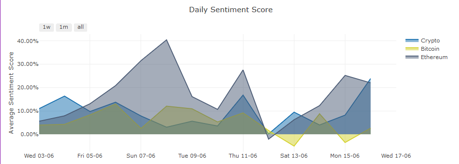
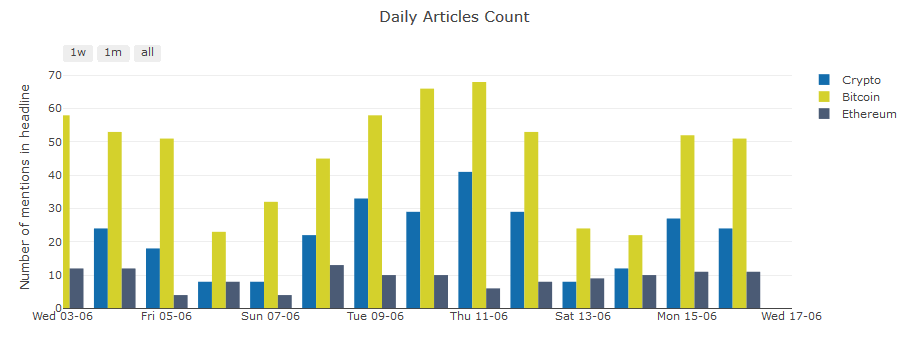

# CryptoNews
CryptoNews is project based on [Flask](https://stackshare.io/flask) and [Dash](https://plotly.com/dash).  
The **ETL** collects the latest news about crypto from various news sources to a [MySQL](https://www.mysql.com/) database.  
**Data Analysis** performs a sentiment analysis on headlines and description of articles, by using [vaderSentiment](https://pypi.org/project/vaderSentiment/).  
Finally, the **Dashboard** displays the average sentiment score for the collected articles and how many were evaluated.

# Dashboard Elements
## Sentiment Analysis

With the use of vaderSentiment I have analysed headline, description and content extract of all the articles and averaged these scores into one main sentiment score. This score goes from -100% for the most negative possible news sentiment up to +100% for a perfectly positive sentiment score on the news

## Daily Articles Count

This is a simple barchart displaying the count for how many times a crypto-related keyword has been mentioned in news headlines for a given day

## ETL Scripts:
1) `main.py`: mian scrip that runs the ETL and Data Analysis scripts every 3600 seconds (1 hour)
2) `extract.py`: fetching the latest news from newsapi.org for the keywords: crypto, bitcoin and ethereum  
3) `transform.py`: data parsing  
4) `load.py`: load parsed data into MySQL server  

## Data Analysis Scripts:
1) `db_dump.py`: covert a complete copy of the artcles table into a DataFrame and dumps it into .pkl format  
2) `data_analysis.py`: performs: data cleaning, Sentiment Analysis and prepares a daily resapling of the data  

## Dashboard Scripts:
1) `dash_app.py`: scipt to setup the layout and plotly graphs necessary to generate the dashboard  
2) `flask_app.py`: an API based on Flask. It collects and displays the latest news in json format  
