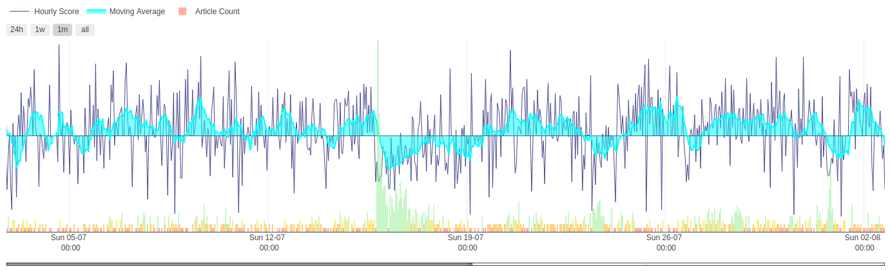
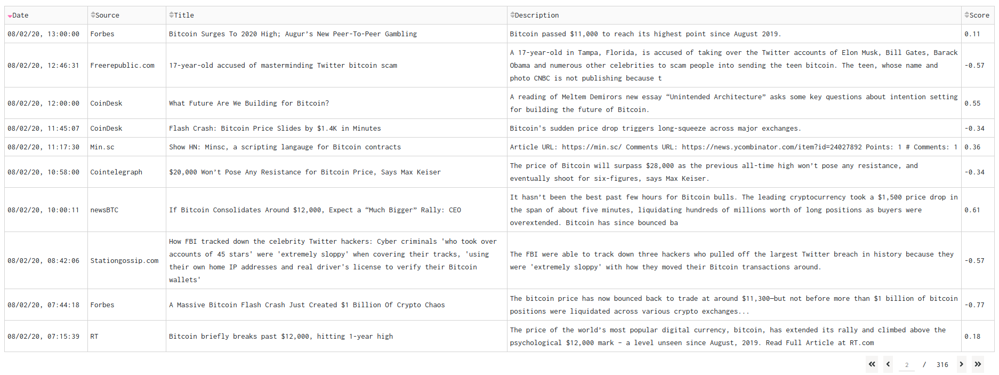

# [MAINTENANCE MODE: Migrating project to AWS]

# Table of Contents
[CryptoNews](#cryptonews)  
[Dashboard Elements](#dashboard-elements)  
[Project Scripts](#project-scripts)  

# CryptoNews
CryptoNews is a project based on `Flask` and `Dash`. The main parts of the project are:  
**ETL**: collecting the latest news about crypto from various news sources to a `MySQL` database.  
**Data Analysis**: performing a sentiment analysis on headlines and description of articles, by using `vaderSentiment`.  
**Dashboard**: display the average sentiment score for the collected articles and how many were evaluated.

# Dashboard Elements
The live dashboard is available on: [http://msitapati.pythonanywhere.com](http://msitapati.pythonanywhere.com) 

## Sentiment Analysis Time Series
  
With the use of `vaderSentiment` I have analysed headline, description and content extract of all the articles and averaged these scores into one main sentiment score for each hour. This score goes from -100% for the most negative possible news sentiment up to +100% for a perfectly positive sentiment score on the news.
To improve the readability of the timeseries I also included a 12h moving average linechart with fill to zero.
At the bottom of the graph there is a simple barchart displaying the count for how many times a crypto-related keyword has been mentioned in news headlines for a given day.

## News Articles Data Table
  
This is a simple data table that displays the news articles metadata and the sentiment score for each article to examine.
As the time series, this table also gets updated when the user selects a certain keyowrd or date range at the top of the dashboard.

# Project Scripts
  
This is how the data moves within this project, so that you can see the final resulting dashboard.

## ETL Scripts:
1) `main.py`: main script that runs the ETL and Data Analysis scripts every 3600 seconds (1 hour)
2) `extract.py`: fetching the latest news from newsapi.org for the keywords: crypto, bitcoin and ethereum  
3) `transform.py`: data parsing  
4) `load.py`: load parsed data into MySQL server  

## Data Analysis Scripts:
1) `db_dump.py`: convert a complete copy of the artcles table into a DataFrame and dumps it into .pkl format  
2) `data_analysis.py`: performs: data cleaning, Sentiment Analysis and prepares a daily resampling of the data  

## Dashboard Scripts:
1) `dash_app.py`: script to setup the layout and plotly graphs necessary to generate the dashboard  
2) `prototypes` folder: contains scripts of past dashboard versions and future versions that I'm currently working on
